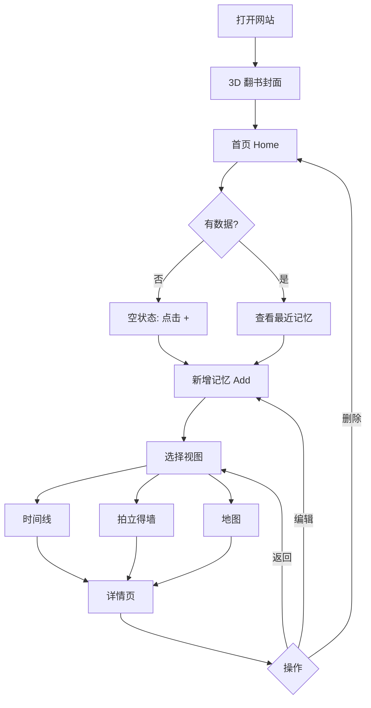

# 产品需求文档（PRD）— Memory Atlas 记忆星图

## 1. 产品概述

**Memory Atlas** 是一款面向个人用户的**纪念相册 Web 应用**，以**电影感暗色 + 极光星云**视觉风格，帮助用户为每一张照片记录**日期、地点、心情、故事**。通过**时间线、拍立得画廊、世界地图**三种视角回溯生命中的高光时刻。

- 主要用途：私人情感记录、回忆管理、地点+时间双轴的视觉回顾
- 目标用户：重视仪式感、喜欢用图像+文字记录生活的个人用户
- 核心价值：把零散的照片升级为可检索、可回味、可回访的「数字博物馆」

## 2. 核心功能

### 2.1 用户角色

首版不设多用户系统，所有数据归属当前浏览器会话所连接的本地后端。

### 2.2 功能模块

1. **首页（Home）**：3D 翻书封面 + 今日记忆 + 最近 6 张预览 + 统计仪表
2. **时间线（Timeline）**：按月份分组的垂直时间轴，心情色点标记
3. **拍立得墙（Gallery）**：自由网格，拍立得相框（随机倾斜），鼠标悬停动效
4. **地图（MapView）**：暗色世界地图，自定义鎏金图钉，点击查看回忆
5. **新增记忆（AddMemory）**：拖拽上传、地图选点、心情选择、故事撰写
6. **记忆详情（MemoryDetail）**：全屏看图、心情标签、完整故事、定位回溯

### 2.3 页面详情

| 页面 | 模块 | 功能描述 |
|------|------|----------|
| Home | 翻书封面 | 3D 翻页动画，点击进入应用主体 |
| Home | Hero 区 | 大标题「Memory Atlas」+ 当前日期 + 心情引导语 |
| Home | 统计仪表板 | 4 个数据卡：总记忆数、覆盖年份、最常心情、最新添加 |
| Home | 最近 6 张 | 拍立得缩略图瀑布，点击进入详情 |
| Timeline | 顶部筛选 | 年份 + 心情下拉筛选 |
| Timeline | 时间轴主体 | 垂直时间线，心情色点，hover 显示卡片 |
| Gallery | 顶部搜索 | 关键词搜索 + 心情筛选 |
| Gallery | 拍立得网格 | 自由布局，相框随机旋转 -8°~+8° |
| MapView | 地图 | Leaflet 暗色瓦片，鎏金发光图钉 |
| MapView | 图钉弹窗 | 显示缩略图 + 标题 + 日期 + 「查看详情」 |
| AddMemory | 拖拽上传区 | 拖拽或点击上传照片，缩略图预览 |
| AddMemory | 地图选点 | 嵌入小型地图，点击/拖动取坐标，自动反查地名 |
| AddMemory | 心情选择 | 8 种心情横向卡片，选中态光晕发光 |
| AddMemory | 故事编辑器 | 多行文本框，placeholder 引导 |
| MemoryDetail | 大图区 | 全屏照片 + 胶片颗粒，背景模糊副本 |
| MemoryDetail | 信息区 | 标题、日期、地点（可点回地图）、心情徽章、完整故事 |

## 3. 核心流程

### 3.1 用户旅程

```
打开网站 → 3D 翻书封面 → 进入应用首页
  ↓
[首次] 无数据 → 空状态引导「记录第一段记忆」
  ↓
点击「+ 新建」→ 拖入照片 → 地图选点 → 选心情 → 写故事 → 保存
  ↓
回到首页：最近 6 张 + 统计更新
  ↓
可切换：时间线 / 拍立得墙 / 地图 三种视图
  ↓
点击任意记忆 → 详情页 → 删除或编辑
```

### 3.2 流程图



## 4. 用户界面设计

### 4.1 设计风格

- **主色调**：宇宙黑 `#0a0612` + 墨紫 `#1a0f2e`
- **强调色**：极光绿 `#00ffa3`、品红霓虹 `#ff006e`、电光青 `#00d4ff`、鎏金 `#d4af37`
- **文字色**：米白 `#f5e6d3` 主体，鎏金 `#d4af37` 标题点缀
- **按钮风格**：玻璃拟态 + 鎏金描边（hover 时金边发光）
- **字体**：
  - Display：`Cormorant Garamond`（衬线，用于标题、Logo）
  - Body：`Manrope`（用于正文、UI）
  - Mono：`JetBrains Mono`（用于坐标、日期、统计数字）
- **布局**：以编辑设计（Editorial）为核心 — 不对称、大留白、杂志排版感
- **图标**：`lucide-react` 线性图标，统一描边粗细

### 4.2 页面设计概览

| 页面 | 模块 | UI 元素 |
|------|------|----------|
| Home | 翻书封面 | CSS 3D perspective + 鎏金书脊 + 极光渐变内页 |
| Home | Hero | 顶部装饰金线 + 大号衬线标题 + 下方手写体副标 |
| Home | 统计卡 | 玻璃面板 + 鎏金数字 + 心情色点 |
| Timeline | 时间轴 | 中央垂直线（鎏金渐变） + 节点心情色发光圆 |
| Gallery | 拍立得 | 白色相纸 + 底部手写日期 + 随机倾斜 + 阴影 |
| Map | 地图 | CartoDB Dark Matter 瓦片 + 自定义 SVG 鎏金图钉 |
| Add | 上传区 | 虚线鎏金边框 + hover 鎏金实心 + 缩略图 |
| Add | 地图 | 圆角深色面板 + 点击落点动画 |
| Add | 心情 | 8 个圆形卡片 + 选中态双圈光晕 |
| Detail | 大图 | 全屏深色 + 顶部胶片颗粒 + 浮层信息卡 |

### 4.3 响应式

- 桌面优先（1280px+）
- 平板（768-1024）：网格降为 2 列
- 手机（< 768）：单列堆叠，导航变汉堡菜单

### 4.4 关键动效

- 翻书封面：CSS 3D 180° 翻页，1.2s ease-in-out
- 极光背景：3 层径向渐变 15-25s 缓慢位移循环
- 拍立得入场：从下方淡入 + 轻微上浮 + 旋转到位，stagger 0.1s
- 心情色点：持续呼吸光晕（box-shadow 动画）
- 图钉：弹出时从 0 缩放到 1 弹性动画
