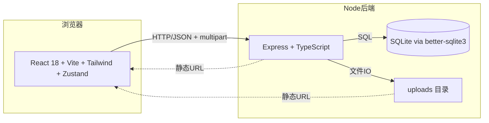
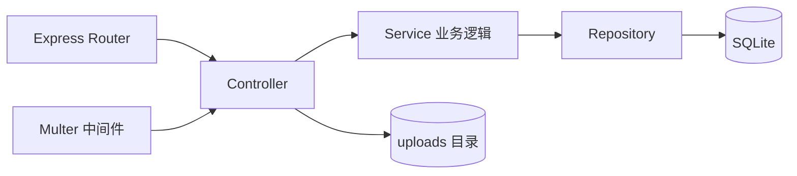
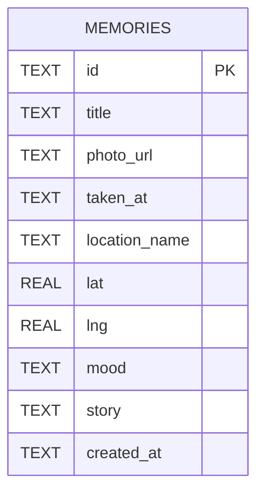

# 技术架构文档 — Memory Atlas 记忆星图

## 1. 架构设计



## 2. 技术栈

| 层 | 选型 | 版本 |
|----|------|------|
| 前端框架 | React | 18.x |
| 前端语言 | TypeScript | 5.x |
| 构建工具 | Vite | 5.x |
| 样式 | Tailwind CSS | 3.x |
| 状态管理 | Zustand | 4.x |
| 动画 | Framer Motion | 11.x |
| 地图 | Leaflet + react-leaflet | 1.9 / 4.x |
| 路由 | react-router-dom | 6.x |
| 后端框架 | Express | 4.x |
| 后端语言 | TypeScript | 5.x |
| 数据库 | SQLite (better-sqlite3) | 11.x |
| 文件上传 | Multer | 1.x |
| UUID | uuid | 9.x |
| CORS | cors | 2.x |

**包管理器**：npm（pnpm 未在环境中检测到，使用稳妥默认）

## 3. 路由定义（前端）

| 路由 | 用途 |
|------|------|
| `/` | 首页：3D 翻书封面 + Hero + 统计 + 最近记忆 |
| `/timeline` | 时间线视图 |
| `/gallery` | 拍立得墙视图 |
| `/map` | 地图视图 |
| `/add` | 新增记忆 |
| `/memory/:id` | 记忆详情 |

## 4. API 定义（后端）

**Base URL**：`http://localhost:5174`

| Method | Path | 说明 |
|--------|------|------|
| GET | `/api/memories` | 列表，支持 `?mood=&year=&q=` 筛选 |
| GET | `/api/memories/:id` | 详情 |
| POST | `/api/memories` | 新建（multipart/form-data） |
| PUT | `/api/memories/:id` | 更新（JSON） |
| DELETE | `/api/memories/:id` | 删除 |
| GET | `/api/memories/stats` | 统计数据 |
| GET | `/uploads/:filename` | 静态照片 |

### 4.1 类型定义

```ts
type Mood = 'joyful' | 'nostalgic' | 'peaceful' | 'exciting'
         | 'melancholy' | 'romantic' | 'adventurous' | 'contemplative';

interface Memory {
  id: string;
  title: string;
  photo_url: string;
  taken_at: string;       // ISO
  location_name?: string;
  lat?: number;
  lng?: number;
  mood: Mood;
  story?: string;
  created_at: string;
}

interface MemoryStats {
  total: number;
  years: number[];
  moodCount: Record<Mood, number>;
  latestAt: string | null;
}
```

### 4.2 POST 请求示例

```http
POST /api/memories
Content-Type: multipart/form-data

photo: <binary>
metadata: {"title":"夏日海风","mood":"peaceful","taken_at":"2024-07-15","lat":22.5,"lng":114.0,"location_name":"深圳","story":"..."}
```

## 5. 服务端架构



## 6. 数据模型

### 6.1 ER 图



### 6.2 DDL

```sql
CREATE TABLE IF NOT EXISTS memories (
  id            TEXT PRIMARY KEY,
  title         TEXT NOT NULL,
  photo_url     TEXT NOT NULL,
  taken_at      TEXT NOT NULL,
  location_name TEXT,
  lat           REAL,
  lng           REAL,
  mood          TEXT NOT NULL,
  story         TEXT,
  created_at    TEXT NOT NULL DEFAULT CURRENT_TIMESTAMP
);
CREATE INDEX IF NOT EXISTS idx_mood  ON memories(mood);
CREATE INDEX IF NOT EXISTS idx_taken ON memories(taken_at);
```

## 7. 目录结构

```
photoAlbum/
├── api/
│   ├── src/
│   │   ├── index.ts
│   │   ├── db/{index.ts, schema.sql}
│   │   ├── routes/memories.ts
│   │   └── middleware/upload.ts
│   ├── uploads/.gitkeep
│   └── package.json
├── src/
│   ├── components/
│   │   ├── AuroraBackground.tsx
│   │   ├── FilmGrain.tsx
│   │   ├── NavBar.tsx
│   │   ├── BookCover.tsx
│   │   ├── PolaroidCard.tsx
│   │   ├── MoodBadge.tsx
│   │   ├── MemoryMap.tsx
│   │   ├── MoodPicker.tsx
│   │   └── EmptyState.tsx
│   ├── pages/
│   │   ├── Home.tsx
│   │   ├── Timeline.tsx
│   │   ├── Gallery.tsx
│   │   ├── MapView.tsx
│   │   ├── AddMemory.tsx
│   │   └── MemoryDetail.tsx
│   ├── store/useMemoryStore.ts
│   ├── utils/{api.ts, moods.ts}
│   ├── App.tsx
│   ├── main.tsx
│   └── index.css
├── public/
├── index.html
├── package.json
├── tailwind.config.js
├── postcss.config.js
├── tsconfig.json
├── vite.config.ts
└── README.md
```

## 8. 端口与运行

| 服务 | 端口 | 启动命令 |
|------|------|----------|
| 前端 dev server | 5173 | `npm run dev` |
| 后端 API | 5174 | `npm run server` |
| 代理 | 前端 → 后端 通过 Vite proxy `/api` → `http://localhost:5174` |

并发启动：`npm run dev:all`（使用 `concurrently`）。
